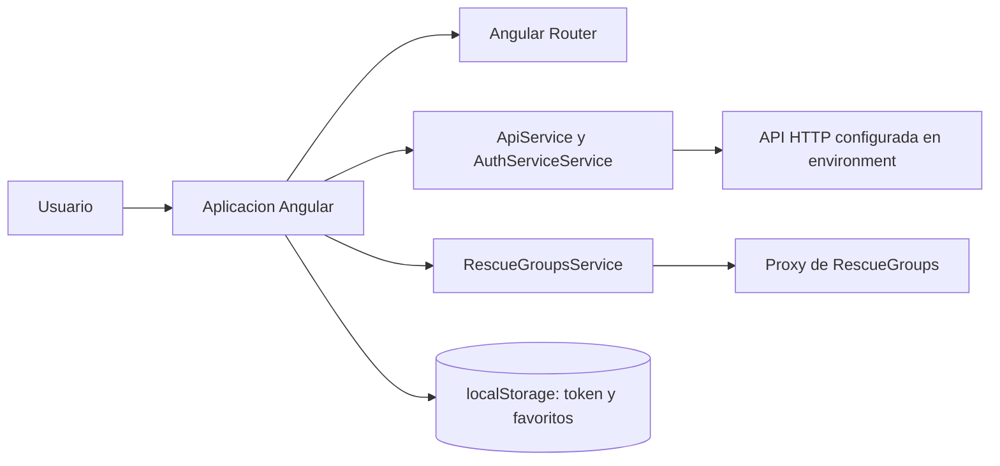

# Protectora

Aplicacion web Angular para explorar animales en adopcion, consultar sus fichas y enviar solicitudes de adopcion. El proyecto contiene el frontend; el backend se consume mediante una API HTTP configurada en los archivos de entorno y no forma parte de este repositorio.

El codigo es un proyecto de aprendizaje de desarrollo web. La aplicacion tiene una base funcional, pero tambien conserva rutas y piezas en evolucion que se indican en la seccion de areas de mejora.

## Objetivos del proyecto

- Crear una experiencia de adopcion con portada, onboarding, galeria y fichas de animales.
- Practicar Angular moderno con componentes standalone, signals, routing y formularios reactivos.
- Consumir una API propia compatible con los recursos de usuarios, animales y solicitudes.
- Integrar la busqueda publica de animales de RescueGroups mediante un proxy configurado fuera del navegador.
- Practicar autenticacion, rutas protegidas, persistencia local y pruebas unitarias.

## Demo y enlaces importantes

- Demo indicada por el proyecto: [protectora-orcin.vercel.app](https://protectora-orcin.vercel.app/portada).
- API de produccion configurada en el frontend: `https://servidor-protectora-bice.vercel.app`.
- API local esperada: `http://localhost:5007`.

La disponibilidad actual de la demo y de la API depende de servicios externos. Este repositorio no incluye el codigo del servidor.

## Funcionalidades publicas

- Portada y tres pantallas de onboarding.
- Registro e inicio de sesion con formularios y validaciones.
- Galeria de animales disponibles, busqueda textual y filtros por especie, edad, genero, ciudad y tamano.
- Ficha individual de cada animal, con estado de adopcion, imagen, descripcion y datos normalizados.
- Mapa embebido de Google Maps.
- Interfaz adaptable con Angular Material, Bootstrap y SCSS.

## Funcionalidades privadas

Las rutas bajo `/home` utilizan `authGuard`. El guard comprueba el usuario cargado por `AuthServiceService` y redirige a `/login` cuando la sesion no esta autenticada.

- Inicio privado con animales destacados.
- Favoritos guardados en `localStorage` mediante signals.
- Formulario de solicitud de adopcion asociado a un usuario y un animal.
- Consulta de solicitudes del usuario.
- Perfil y opciones de usuario.
- Cierre de sesion eliminando el token local.

No hay un panel de administracion implementado como ruta en `app.routes.ts`. Aunque `ApiService` contiene operaciones CRUD (crear, consultar, actualizar y borrar) para animales, formularios y usuarios, este repositorio no demuestra una interfaz de administracion ni control de roles.

## Arquitectura general

La aplicacion es un frontend SPA (Single Page Application): el navegador carga Angular y el router cambia las vistas sin recargar toda la pagina. Los componentes delegan las peticiones HTTP en servicios inyectables.



El repositorio no contiene Server Components ni Server Actions. Esos conceptos pertenecen normalmente a frameworks con renderizado en servidor; aqui la aplicacion utiliza componentes standalone de Angular y servicios del cliente.

## Flujo de datos

1. `AppComponent` intenta recuperar la sesion con el token almacenado.
2. `AuthServiceService` llama a `/user/checksession` y mantiene el usuario en un signal.
3. `authInterceptor` añade `Authorization: Bearer <token>` a las peticiones cuando existe un token.
4. `ApiService` centraliza las operaciones sobre animales, formularios y usuarios.
5. Como `rescueGroupsEnabled` vale `true` en ambos entornos, la galeria usa `RescueGroupsService` para buscar animales y consultar su detalle a traves del proxy configurado.
6. Los favoritos se serializan en `localStorage`; no se guardan en la API.

Un JWT (JSON Web Token) es un token firmado que permite al backend reconocer una sesion sin enviar la contraseña en cada peticion. El frontend solo almacena y envia el token; la firma, la expiracion y la autorizacion real deben comprobarse en el backend, que no esta incluido aqui.

## Stack tecnologico explicado

| Tecnologia                | Uso comprobado en este repositorio                                      |
| ------------------------- | ----------------------------------------------------------------------- |
| Angular 21                | Framework de la interfaz, componentes standalone y ciclo de aplicacion. |
| TypeScript 5.9            | Tipado del codigo de la aplicacion.                                     |
| Angular Router            | Rutas publicas, rutas hijas y carga diferida con `loadComponent`.       |
| Angular HttpClient y RxJS | Peticiones HTTP y flujos asincronos mediante `Observable`.              |
| Angular Signals           | Estado reactivo local, por ejemplo usuario y favoritos.                 |
| Angular Material          | Botones, iconos, formularios, tarjetas, modales y otros controles.      |
| Bootstrap 5               | Dependencia de estilos disponible en el proyecto.                       |
| SCSS                      | Estilos globales y de componentes.                                      |
| Jasmine y Karma           | Configuracion de pruebas unitarias de Angular.                          |
| RescueGroups              | API externa consultada a traves de la URL proxy del entorno.            |

El proyecto no incluye dependencias de Express, MongoDB, bcrypt, `jsonwebtoken` ni un servidor Node propio en `package.json`. Tampoco implementa cache de respuestas: `localStorage` se usa para estado del navegador, no como cache HTTP.

## Estructura de carpetas

```text
src/
  app/
    components/       Componentes reutilizables, como la barra de navegacion
    guards/           Proteccion de rutas
    home/             Layout y pagina privada principal
    interceptors/     Interceptor del encabezado de autorizacion
    login/ register/  Flujos de autenticacion
    pages/            Galeria, detalle, mapa, perfil, favoritos y solicitudes
    servicios/        API, autenticacion y adaptador de RescueGroups
    shared/           Atomos y moleculas reutilizables
    types/            Tipos de animales, usuarios, formularios y autenticacion
    app.routes.ts     Definicion del router
    app.config.ts     Providers principales de Angular
  assets/             Imagenes de onboarding, logos, iconos y placeholders
  environments/       Configuracion de desarrollo y produccion
  styles.scss         Estilos globales
angular.json          Build, serve, assets, estilos y Karma
package.json          Dependencias y scripts
Procfile              Comando web heredado: npm start
convert.js             Script suelto para escribir una plantilla HTML de login
```

## Rutas principales

| Ruta                    | Acceso          | Vista                  |
| ----------------------- | --------------- | ---------------------- |
| `/`                     | Publico         | Redirige a `/portada`. |
| `/portada`              | Publico         | Portada.               |
| `/slide/:id`            | Publico         | Onboarding.            |
| `/login`                | Publico         | Inicio de sesion.      |
| `/register`             | Publico         | Registro.              |
| `/home`                 | Requiere sesion | Inicio privado.        |
| `/home/galeria`         | Requiere sesion | Galeria.               |
| `/home/galeria/:id`     | Requiere sesion | Detalle del animal.    |
| `/home/map`             | Requiere sesion | Mapa.                  |
| `/home/profile`         | Requiere sesion | Perfil.                |
| `/home/opciones`        | Requiere sesion | Opciones.              |
| `/home/adopcion/:id`    | Requiere sesion | Solicitud de adopcion. |
| `/home/mis-solicitudes` | Requiere sesion | Solicitudes.           |
| `/home/favoritos`       | Requiere sesion | Favoritos.             |
| `/home/user`            | Requiere sesion | Datos del usuario.     |

La ruta comodin redirige a `/portada`. Algunas llamadas de navegacion internas usan `/home/gallery` y `/home/formAd`, pero esas rutas no estan declaradas actualmente; es una tarea pendiente de coherencia del routing.

## Contrato HTTP esperado

Estas son las rutas que el frontend construye. El contrato exacto de respuestas pertenece al backend externo.

| Metodo                            | Endpoint                      | Uso                                                              |
| --------------------------------- | ----------------------------- | ---------------------------------------------------------------- |
| `POST`                            | `/user/login`                 | Iniciar sesion; espera token y usuario.                          |
| `POST`                            | `/user/register`              | Registrar usuario.                                               |
| `POST`                            | `/user/checksession`          | Validar la sesion actual.                                        |
| `GET`                             | `/animales`                   | Listar animales cuando se desactiva RescueGroups.                |
| `GET`                             | `/animales/:id`               | Consultar un animal cuando se desactiva RescueGroups.            |
| `POST` / `PUT` / `DELETE`         | `/animales` y `/animales/:id` | Operaciones CRUD de animales disponibles en el servicio cliente. |
| `GET` / `POST` / `PUT` / `DELETE` | `/form` y `/form/:id`         | Consultar y gestionar solicitudes.                               |
| `GET` / `POST` / `PUT` / `DELETE` | `/user` y `/user/:id`         | Operaciones de usuario disponibles en el servicio cliente.       |
| `POST`                            | `/upload`                     | Subir una imagen mediante `FormData`.                            |
| `POST`                            | `/rescuegroups`               | Proxy para busqueda y detalle publico de RescueGroups.           |

Las operaciones de escritura y el acceso a usuarios deben considerarse protegidos por el backend. El frontend envia el token, pero este repositorio no puede demostrar las reglas de autorizacion del servidor.

## Variables de entorno

Angular no lee un archivo `.env` en este proyecto. Usa objetos TypeScript:

- `src/environments/environment.ts`: desarrollo, con API local.
- `src/environments/environment.prod.ts`: produccion, con API remota.

Campos utilizados:

```ts
export const environment = {
  production: false,
  apiUrl: "http://localhost:5007",
  rescueGroupsEnabled: true,
  rescueGroupsProxyUrl: "http://localhost:5007/rescuegroups",
};
```

El ejemplo es ficticio salvo las URLs que reflejan la configuracion versionada. No se incluyen claves API, secretos JWT ni credenciales. `rescueGroupsEnabled` controla si la app usa el proxy de RescueGroups o los endpoints `/animales` del backend.

## Instalacion local

Requisitos: Node.js compatible con Angular CLI 21 y npm.

```bash
git clone https://github.com/BryanDZV/Protectora.git
cd Protectora
npm install
npm start
```

La aplicacion se sirve normalmente en `http://localhost:4200`. Para que las pantallas que hacen peticiones funcionen, debe existir un backend compatible en `http://localhost:5007` o debe modificarse `environment.ts` con una URL accesible. El backend no se puede levantar desde este repositorio.

## Scripts disponibles

Los scripts coinciden con `package.json`:

| Comando                   | Descripcion                                                                             |
| ------------------------- | --------------------------------------------------------------------------------------- |
| `npm start`               | Ejecuta `ng serve` para desarrollo.                                                     |
| `npm run build`           | Ejecuta `ng build`; la configuracion por defecto es produccion.                         |
| `npm run watch`           | Compila en modo desarrollo y observa cambios.                                           |
| `npm test`                | Ejecuta las pruebas con Karma.                                                          |
| `npm run ng -- <comando>` | Expone directamente Angular CLI, por ejemplo `npm run ng -- generate component nombre`. |

## Pruebas actuales

Hay specs de componentes, servicios, guard e interceptor dentro de `src/app`, entre ellos `ApiService`, `AuthServiceService`, `authGuard`, `authInterceptor`, login, registro, galeria, favoritos y solicitudes.

El runner configurado es Karma con Jasmine y `karma-chrome-launcher`. No hay script separado de cobertura ni una politica de cobertura automatizada en `package.json` o `angular.json`. Para ejecutarlas:

```bash
npm test
```

## Calidad, CI/CD y despliegue

- El compilador TypeScript tiene `strict` y las comprobaciones estrictas de templates de Angular activadas.
- El build de produccion usa AOT, optimizacion, hash de archivos, source maps desactivados y presupuestos de tamano.
- No hay configuracion de ESLint ni Prettier en `package.json`.
- No hay workflow de GitHub Actions ni otra configuracion de CI/CD dentro del repositorio.
- Existe un `Procfile` con `web: npm start`, pero no hay configuracion suficiente aqui para afirmar un despliegue concreto.
- `angular.json` genera la salida en `dist/protectora` y reemplaza `environment.ts` por `environment.prod.ts` en produccion.

CI (integracion continua) seria un proceso automatico que ejecuta build y pruebas en cada cambio. En este estado queda pendiente incorporarlo.

## Decisiones tecnicas que estoy aprendiendo

- **Componentes standalone:** cada componente declara sus dependencias directamente y no necesita un `NgModule` propio.
- **Lazy loading:** `loadComponent` carga una vista cuando se navega a ella, reduciendo el codigo inicial descargado.
- **Signals y RxJS:** los signals representan estado reactivo local; los `Observable` modelan peticiones y flujos asincronos.
- **Separacion de responsabilidades:** los componentes coordinan la interfaz y los servicios concentran HTTP y autenticacion.
- **Guard e interceptor:** el guard decide si una ruta puede abrirse; el interceptor añade el token a las peticiones.
- **CRUD:** crear, leer, actualizar y borrar son las operaciones que `ApiService` expone para varios recursos.
- **Proxy de API:** el frontend llama a `/rescuegroups` y no contiene una clave privada de RescueGroups.
- **Cache:** no se ha implementado una cache HTTP; los favoritos usan persistencia local del navegador.

## Areas de mejora

- Alinear las navegaciones `/home/gallery` y `/home/formAd` con las rutas declaradas `/home/galeria` y `/home/adopcion/:id`.
- Añadir manejo centralizado de errores HTTP, estados de carga y expiracion del token.
- Revisar la estrategia de persistencia del JWT en `localStorage` antes de un uso productivo.
- Completar pruebas de servicios y flujos de autenticacion con respuestas HTTP simuladas.
- Incorporar lint, Prettier y un workflow de CI que ejecute `npm test` y `npm run build`.
- Documentar o incluir el backend compatible, sus esquemas, roles y reglas de autorizacion.
- Revisar el uso de URLs e imagenes externas, incluido el mapa y la imagen del modal de adopcion.
- Eliminar o integrar `convert.js` si deja de ser necesario.

## Objetivo profesional y de aprendizaje

Este proyecto sirve para practicar el ciclo completo de un frontend Angular: modelar datos, construir vistas, consumir una API, proteger rutas, gestionar estado y validar formularios. Para presentarlo profesionalmente conviene mantener diferenciadas las funcionalidades demostradas en este repositorio de las responsabilidades del backend externo y continuar cerrando las areas de mejora indicadas.

## Autor

**Bryan Zavala**

- GitHub: [BryanDZV](https://github.com/BryanDZV)
